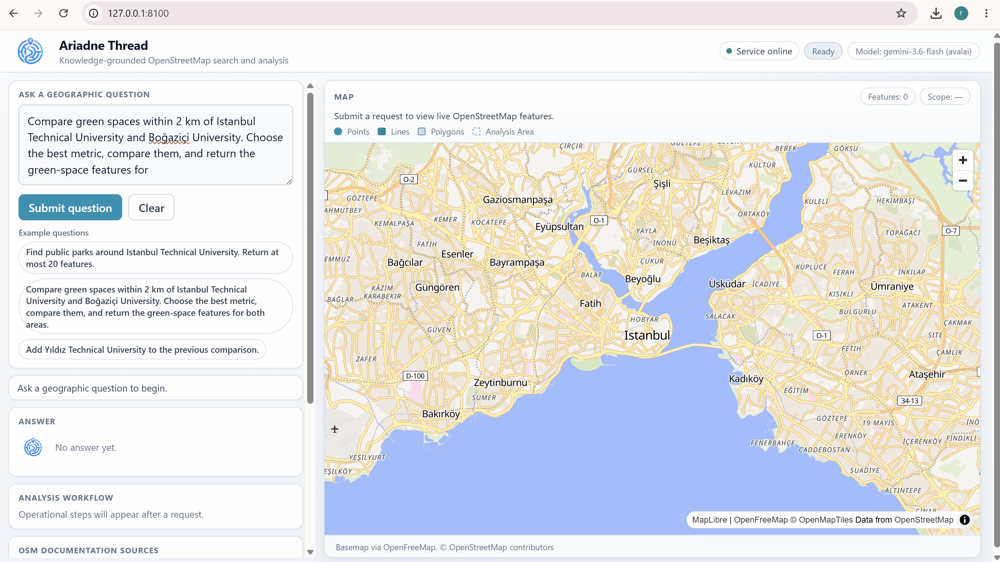
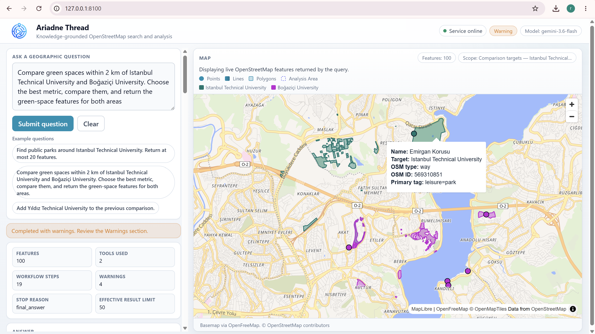
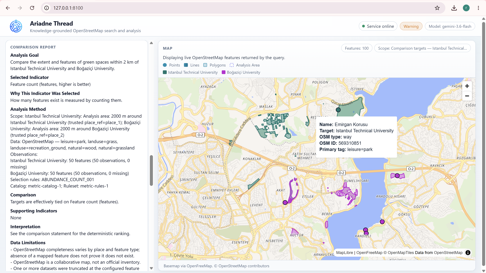
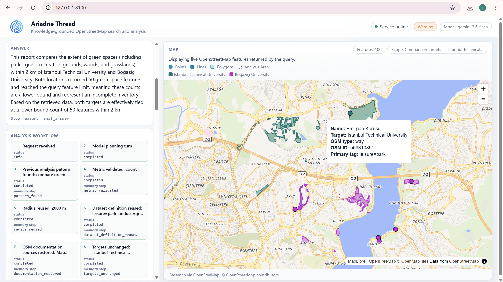

# Ariadne Thread

Ariadne Thread is an open-source research software framework for
knowledge-grounded geographic analysis using AI agents, spatial data, and
explainable analytical workflows.

It is an AI-assisted spatial analysis companion: it helps formulate a geographic
question, retrieve spatial information, select an appropriate analytical method,
perform a statistical comparison, and return a transparent result that can be
inspected from the question through to the map.

The name refers to Ariadne’s thread in Greek mythology, a line that made a path
through complexity recoverable. The software applies the same idea to GeoAI: a
traceable thread from the geographic question to data retrieval, spatial
analysis, and interpretation.

## Demo



*End-to-end run of a multi-target green-space comparison: the planner grounds
the request, retrieves OpenStreetMap features, computes a catalog metric, and
exposes the workflow and data provenance in the interface.*

## Key Features

- **AI-assisted geographic question answering.** Natural-language requests are
  turned into a small set of controlled tools, not free-form code execution.
- **OpenStreetMap integration.** Live features are retrieved through a
  deterministic Overpass builder; the model does not write Overpass QL.
- **Spatial feature retrieval.** Named places are resolved through a trusted
  geocoder tool; results are returned as GeoJSON.
- **Statistical comparison.** Equal-scope multi-target comparisons are computed
  by deterministic analytics (counts, densities, areas, distances).
- **Explainable workflows.** Each run records planning turns, tool calls, and
  stop reasons as an inspectable sequence.
- **Data provenance.** OSM Wiki citations, compiled Overpass queries, tags,
  scopes, and attribution travel with the result.
- **Reproducible spatial analysis.** Bounded loops, validated tool arguments,
  and offline tests keep a run checkable after it finishes.

## System Architecture

A geographic question moves through four layers: interaction, planning and
grounding, controlled tools and live OSM data, then transparent outputs.


Ariadne Thread turns a natural-language geographic question into a traceable
analytical workflow. The planner grounds the request in OSM documentation,
executes validated tools, retrieves live OpenStreetMap features, and computes
spatial or statistical outputs in deterministic code. The result is returned
with the map, comparison, citations, and workflow so the path from question
to answer stays inspectable.

Details: [docs/architecture.md](docs/architecture.md).

## Retrieval-Augmented Generation (RAG)

Ariadne Thread combines language reasoning with domain-specific geographic
knowledge instead of relying only on the model’s internal parameters.

A **whitelisted** OSM Wiki corpus is embedded (BGE-M3) and stored in PostgreSQL
with pgvector. `search_osm_knowledge` returns scored passages. Those citations
ground tag choices and appear in the OSM Documentation Sources panel. RAG never
populates GeoJSON; live features come only from Overpass.

Details: [docs/rag.md](docs/rag.md).

## Traceability and Explainability

Every result keeps an analytical thread from question to answer:

- workflow steps and tool outcomes
- retrieved documentation sources
- analytical decisions (catalog metric, feasibility, limitations)
- generated Overpass queries
- feature-level OSM identifiers and attribution

Hidden model reasoning is stripped at the provider boundary and is not part of
the public trace.

Details: [docs/traceability.md](docs/traceability.md).

## Spatial Analysis Capabilities

- OpenStreetMap point, line, and polygon features
- Buffer / radius queries around resolved places
- GeoJSON visualization and download
- Statistical comparison across analysis targets
- Geographic indicators from a fixed catalog (domain → candidates → one
  selected method, then deterministic execution)

Distances are geodesic nearest-feature metres, not routed travel time.

## Active Learning and Model Improvement

**Implemented**

- Optional feedback on a completed run (`POST /api/v1/agent/feedback`)
- Deterministic scoring that can retain informative or failing cases
- A human review queue (approve, correct, reject)
- Export of curated examples for later experiments

Active learning does not train a model during a request and does not fail a
user query if the review store is unavailable.

**Future research**

- Human-in-the-loop refinement of planner decisions
- Better support for metric-selection failures
- Adaptive agent behaviour after reviewed corrections

See [docs/active-learning-and-finetuning.md](docs/active-learning-and-finetuning.md).

## Fine-tuning Research Direction

**Current system**

`finetuning/` is a separate package. The running service never imports it and
never starts training. The packages meet only at a versioned dataset file
produced by the exporter.

**Future experiments**

- Domain-specific geographic reasoning (tag choice, comparison goals)
- Adaptation of language models for structured GeoAI plans
- Improving GeoAI understanding under a frozen evaluation split

This repository does not contain a completed training run or published adapter.

## Deployment

Install dependencies, create the PostGIS/pgvector database, index the OSM Wiki
corpus, and start the API and web interface from one process:

```bash
python3 -m venv .venv
./.venv/bin/pip install -e ".[dev]"
cp .env.example .env
./.venv/bin/alembic upgrade head
./.venv/bin/uvicorn app.main:app --host 127.0.0.1 --port 8100 --reload
```

Full environment, database, and test instructions:
[docs/deployment.md](docs/deployment.md).

API examples: [docs/usage.md](docs/usage.md).

## Technology Stack

**Backend.** Python 3.10, FastAPI, PostgreSQL, PostGIS, pgvector.

**AI.** LLM providers (Ollama or an OpenAI-compatible gateway), BGE-M3
embeddings, RAG over a local OSM Wiki corpus.

**Spatial.** OpenStreetMap, Overpass API, Nominatim-compatible place search,
GeoJSON.

**Frontend.** FastAPI-served web interface and MapLibre map visualization.

## Screenshots

### User geographic question



*The console accepts a geographic question and shows retrieved features on the
map.*

### Analytical answer and spatial comparison



*The report states the goal, selected indicator, method, and limitations. Map
layers are coloured by analysis target.*

### Execution workflow and provenance



*Workflow steps and OSM Wiki citations make the analytical thread inspectable.*

## Research Software Positioning

Ariadne Thread is designed as:

- open-source research software
- a GeoAI experimentation platform
- a reproducible spatial analysis framework
- an explainable, AI-assisted geographic analysis system

It is not a production GIS product. There is no authentication or multi-tenant
isolation in this tree. Invalid analytical plans are rejected; numbers are never
invented.

## Documentation

- [Architecture](docs/architecture.md)
- [RAG](docs/rag.md)
- [Traceability](docs/traceability.md)
- [Deployment](docs/deployment.md)
- [Usage](docs/usage.md)
- [Active learning and fine-tuning](docs/active-learning-and-finetuning.md)

## License and attribution

This software is released under the [MIT License](LICENSE).

Map data © [OpenStreetMap contributors](https://www.openstreetmap.org/copyright)
(ODbL). OSM Wiki text is CC-BY-SA.
