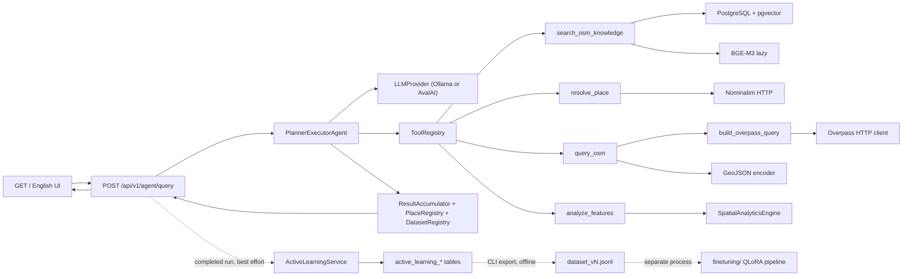

# Ariadne Thread — Architecture

**Knowledge-Grounded Planner-Executor GeoAgent with Tool Orchestration**

Implemented MVP architecture (not a future plan). The system turns a
natural-language GIS request into a small number of *controlled* OpenStreetMap
operations and returns a verifiable answer: tags used, documentation passages,
generated Overpass QL, live features, warnings, and an operational trace.

## Component diagram



Dotted edges are offline or best-effort: nothing on them can slow down, block or
fail a request, and no runtime path leads back from `finetuning/` into the
service.

## Request lifecycle

```
User (UI or curl)
 ↓
validated AgentQueryRequest { message }
 ↓
asyncio.wait_for(agent.run, AGENT_REQUEST_TIMEOUT_SECONDS)
 ↓
Ollama turn (prompted JSON tool protocol by default)
 ↓
Tool Registry validates name + Pydantic args
 ↓
search_osm_knowledge and/or resolve_place and/or query_osm
and/or analyze_features (state-aware model-facing eligibility)
 ↓
compact observation → model (never full GeoJSON)
structured payload → ResultAccumulator
(request-scoped place_ref + dataset_ref)
 ↓
final_answer or budget stop
 ↓
AgentQueryResponse (+ optional analysis) → HTTP JSON / UI render
```

Opening `GET /` does **not** touch PostgreSQL, Ollama, Overpass, or BGE-M3.

## Composition root and lifecycle

`app/bootstrap.py` builds:

settings → Database → embedding provider → retriever → Overpass tool →
resolve_place tool → analyze_features tool → LLM provider (Ollama or AvalAI) →
Tool Registry → PlannerExecutorAgent

`app/main.py` lifespan attaches these to `app.state` and closes them on shutdown.
Nothing at import time opens pools, loads models, or dials the network.

## Provider boundaries

| Concern | Contract | Implementation |
|---|---|---|
| LLM | `LLMProvider` | `OllamaProvider` or `AvalAIProvider` (`LLM_PROVIDER`) |
| Embeddings | `EmbeddingProvider` | `BgeM3EmbeddingProvider` (lazy, `local_files_only`) |
| Retrieval | `KnowledgeRetriever` | session-bound pgvector retriever |
| Overpass | `OverpassClient` | `HttpOverpassClient` |
| Places | `PlaceResolver` | `NominatimPlaceResolver` |
| Tools | `Tool` + registry | `search_osm_knowledge`, `resolve_place`, `query_osm`, `analyze_features` |

### Prompted vs native tools

`LLM_PROVIDER` selects the chat backend (`ollama` default, or `avalai`).

For **Ollama**, `OLLAMA_TOOL_MODE` selects the protocol explicitly (`prompted`
default, or `native`). Advertised Ollama `tools` capability means the HTTP API
may accept a tools payload; it does **not** prove reliable native tool-call
emission for `deepseek-r1:7b`. **Prompted** planning requests set Ollama
`format: "json"` so the model emits syntactic JSON.

For **AvalAI** (OpenAI-compatible, default model `gemini-3.6-flash`), native
tool calling is preferred. Eligible Tool Registry schemas are converted to
OpenAI `tools` on each turn. If the route rejects a `tools` payload, the
provider falls back **explicitly** and logs `tool_mode=prompted_fallback`.
Accepting a `tools` field is not treated as proof of native emission; the
`diagnose-avalai` command checks that `tool_calls` are actually returned.

That does **not** replace Ariadne protocol validation: prompted replies must
still be exactly one of `{"tool_calls":[…]}` or `{"final_answer":"…"}`, and
native `tool_calls` still go through Tool Registry / Pydantic. At most one
complete outer Markdown fence may wrap a prompted object (legacy). Prose
before/after JSON, tool names as top-level keys, and mixed envelopes are
`llm_protocol_error`. Invalid tool arguments become structured
`tool_argument_error` observations for bounded correction (not an immediate
agent stop). Model-facing RAG observations are compact top-N grounding; the
API/UI may still show a broader citation list. `analyze_features` is omitted
from the model-facing catalogue until live datasets exist *and* analytical
intent is detected; the registry still registers it. Calls to ineligible tools
are rejected as `tool_not_eligible`. Dependent tools may only execute after
their required backend-generated references exist (`place_ref`, `dataset_ref`).
Hidden Ollama `thinking` / `<think>` content (and any AvalAI reasoning fields)
is discarded at the provider boundary. Ollama is not required when
`LLM_PROVIDER=avalai`.

## Multi-target landmark comparison

Equal-radius comparisons around named landmarks do **not** widen `query_osm`
into a multi-target tool. The flow is:

1. Ground the feature concept (`search_osm_knowledge` → e.g. `leisure=park`).
2. Resolve each landmark with `resolve_place` → request-scoped `place_N`.
3. Build identical analysis radii from the **user** distance (e.g. 2000 m).
4. Call `query_osm` once per target with `place_ref_scope` (never a `place` list;
   never model-invented lat/lon).
5. Register each live result as `osm_result_N`.
6. Run `analyze_features` for deterministic metrics / comparison.
7. Combine FeatureCollections for map/download with application-level
   `analysis_target` / `analysis_target_label` / `target_index` (OSM tags
   untouched). Each target keeps its own copies so the map can colour by
   target. A feature that falls in both radii is duplicated once per target.
   Green-space comparisons query a union of tags (`leisure=park`,
   `landuse=grass`, `landuse=recreation_ground`, `natural=wood`,
   `natural=grassland`) via `tag_match=any`. Parks-only requests stay
   `leisure=park`.

**LLM must never invent landmark coordinates.** Trusted coordinates come only
from user-supplied numbers or `resolve_place`.

`<think>…</think>` is stripped in `app/llm/tool_protocol.py` before the
orchestrator, trace, API, UI, or logs see the reply.

## Tool Registry

The registry is the **only** execution path. The orchestrator never calls the
retriever, Overpass client, query builder, or database directly. Unknown tools
and invalid arguments become structured tool errors the model may observe while
budget remains.

## Documentation vs live data

| | `search_osm_knowledge` | `query_osm` |
|---|---|---|
| Source | Local OSM Wiki corpus | Overpass API |
| Output | Passages + scores | Features + GeoJSON + generated QL |
| May fill `geojson` | No | Yes |

## Safe Overpass path

```
LLM JSON args → spatial-trust check
 (named place | user-supplied coords | trusted place_ref_scope)
 → OsmFeatureQuery (extra=forbid; limit ≤ MAX_LIMIT; one scope)
 → place_ref_scope → PointRadius via PlaceRegistry (server-side)
 → build_overpass_query (pure, deterministic)
 → configured OVERPASS_BASE_URL only
 → bounded client retry on 502/503/504 (max 2 attempts; model never controls retries)
 → validated JSON → GeoJSON FeatureCollection
```

No `raw_query` / `overpass_ql` escape hatch. Unsafe literals are rejected, not
escaped. Timeout, max results, and max response bytes are application-controlled.
Invented bbox/point coordinates are rejected unless those numbers appear in the
user message. Landmark radii use `place_ref_scope` after `resolve_place`.
City requests should use named-place scope. Place strings such as
`Tehran, Iran` resolve the Overpass area on the primary toponym (`Tehran`) via
`name` / `name:en`. The `out … N` clause and a post-normalization feature cap
both enforce the validated effective limit.

## Trusted place resolution

```
resolve_place({query, limit?})
 → configured NOMINATIM_BASE_URL only (model never supplies URLs)
 → ranked hits → deterministic Tehran-context / ambiguity checks
 → PlaceRegistry place_N {lat, lon, label, source, source_id}
 → compact observation for the LLM
```

Coordinate provenance is recorded in the execution trace. Grounded OSM tags
from documentation are locked for subsequent `query_osm` calls in the request
so silent substitutions such as `amenity=public_park` are rejected.

Transient Overpass failures are classified as `overpass_timeout`,
`overpass_rate_limited`, `overpass_upstream_error`, or `overpass_bad_response`.
Raw HTML gateway bodies are never returned to the model, UI, or public errors.
A failed live query does **not** invalidate successful documentation grounding
(`leisure=park` remains valid after HTTP 504). The model receives a compact
`tool_error` observation instructing it not to invent alternate tags or
coordinates. Empty `FeatureCollection` results remain distinct from timeouts.

## GeoJSON separation

`query_osm` returns:

1. compact observation for the LLM (counts, status, warnings; no FeatureCollection)
2. structured payload for API/UI (full GeoJSON + provenance)

`ResultAccumulator` merges multi-target live results into one downloadable
FeatureCollection for the response; it is not re-injected into chat turns.
Analysis buffers and university reference points are not counted as park
features.

## API flow

- Canonical endpoint: `POST /api/v1/agent/query`
- Request: `{ "message": "…" }` (an optional conversation identifier may be
  supplied so follow-up questions stay in the same session)
- Response: answer, `knowledge_sources`, `execution_trace`, `overpass_query`,
  `geojson`, warnings/errors, `stop_reason`, attribution, `request_id`,
  optional structured provenance
- Errors: 422 validation, 429 rate limit, 503 dependency, 504 timeout, 500 sanitized
- Correlation: `X-Request-ID` middleware

## UI flow

English GeoAI console at `GET /` (same origin). Layout: left analysis panel +
right MapLibre map (`ariadne-results` source, optional `ariadne-analysis-area`).
The backend FeatureCollection is the map/download source of truth. Browser-local
GeoJSON download uses `application/geo+json`. Analysis Workflow renders
`execution_trace` operational events only, plus one clearly marked client-side
“Rendered GeoJSON on the map” event. Documentation sources, live summary,
warnings/errors, GeoJSON preview, and read-only Overpass provenance are separate.

## Timeout boundaries

| Budget | Setting |
|---|---|
| Whole HTTP agent request | `AGENT_REQUEST_TIMEOUT_SECONDS` |
| Each Ollama call | `OLLAMA_REQUEST_TIMEOUT_SECONDS` |
| Overpass HTTP | `OVERPASS_TIMEOUT_SECONDS` |
| Readiness probes | `READY_CHECK_TIMEOUT_SECONDS` |
| Loop structure | `AGENT_MAX_TOOL_ROUNDS` / `AGENT_MAX_TOOL_CALLS` |

## Persistence

Dedicated DB `osm_geoagent`:

- `knowledge_documents` unique on `(domain, source_url)`
- `knowledge_chunks` unique on `(document_id, chunk_index)`, `VECTOR(1024)`
- `active_learning_candidates` one row per retained run (no GeoJSON, no prompts)
- `active_learning_reviews` append-only audit of human review decisions
- `training_dataset_exports` dataset lineage (version, candidate ids, digest)
- Live GeoJSON is request-scoped (not persisted)
- No model reasoning is stored

Corpus whitelist: `app/rag/corpus.py` (eight OSM Wiki pages). No crawler.

## Operational trace

Events only: `request_received`, `llm_turn`, `tool_call`, `tool_result`,
`tool_error`, `final_answer`, `stopped`. Optional safe `details` may include
scope type, named place, radius, validated tags, effective limit, feature count,
duration, and status/error codes. No hidden reasoning, prompts, GeoJSON dumps,
or credentials.

## Security boundaries

- No shell / eval / exec / model SQL
- No arbitrary URL proxy
- No custom Overpass endpoint from the model
- UI escapes text; validates http(s) source links; CSP on the UI route
- Logs: correlation ID, route, duration, stop reason, tool-call count,
  feature count, safe error codes — not secrets or full payloads

## Spatial analytics and analytical traceability

Implemented in `app/analytics/`. Governing rule:

> LLM selects the analytical plan; deterministic code computes the metrics.
> Traceability records structured decision provenance without exposing
> chain-of-thought.

| Artifact | Meaning |
|---|---|
| `AnalysisPlan` | What the model selected for analysis (validated tool args) |
| `AnalysisDecisionTrace` | Why the metric/method was selected (rules, feasibility, re-plans) |
| `CalculationProvenance` | How deterministic values were produced |
| `AnalysisResult` | Computed source-of-truth numeric results |
| `ComparisonReport` | Human-readable interpretation assembled after results exist |

Flow:

1. `query_osm` registers a request-scoped `dataset_ref` (`osm_result_N`).
2. The model proposes an `AnalysisPlan` (closed metric catalog + rule IDs).
3. `analyze_features` validates feasibility; at most one structured re-plan.
4. `SpatialAnalyticsEngine` / `ComparisonEngine` compute numbers (stdlib geodesy).
5. Optional `analysis` on `AgentQueryResponse`; UI shows Comparison Report and
   Analysis Method only when present.

Versions: `metric-catalog-1`, `metric-rules-1`. Initial metrics include count,
density, sum/mean/median/stdev/min/max, ratio, area metrics, nearest-distance
metrics, and coverage percentage. Sample standard deviation uses
`statistics.stdev`.

## Active learning and fine-tuning

Full description: [active-learning-and-finetuning.md](active-learning-and-finetuning.md).

`app/active_learning/` consumes finished runs and decides, deterministically,
whether one is informative enough to keep for human review. It is a consumer of
the operational trace, not a participant in the loop: the orchestrator is
unaware of it, `observe_run` swallows its own failures, and the subsystem can be
switched off entirely with `ACTIVE_LEARNING_ENABLED=false`.

Governing rule:

> The runtime selects and exports. Training happens elsewhere, from a versioned
> file, after a human approved it.

| Artifact | Meaning |
|---|---|
| `ActiveLearningCandidate` | A retained run, its signals and its review state |
| `SelectionReason` | Bounded reason codes explaining *why* it was retained |
| `ScoreBreakdown` | Deterministic informativeness score and its components |
| `DatasetManifest` | Lineage of one exported dataset version |

`finetuning/` is a separate top-level package with its own `pyproject.toml`. It
is never imported by `app/`, never started by the FastAPI lifespan, and reaches
Ariadne only through exported dataset files. Tests assert both directions of
that boundary, including that no ML library is imported at module scope.

## Known limitations

- Local 7B routing is imperfect; prompted mode is conservative
- Analytics plan quality varies; invalid plans are rejected (numbers never invented)
- `area["name"=…]` place scopes can be ambiguous
- Landmark coordinates come from `resolve_place` or explicit user input
- Distances are geodesic nearest-feature meters, not route-based
- Relation geometry support is partial (warnings, no invention)
- CPU embedding latency on first use / indexing
- Browser needs network for MapLibre / OpenFreeMap / fonts
- Persian/Arabic basemap labels require MapLibre's RTL text plugin
  (`@mapbox/mapbox-gl-rtl-text` 0.2.3, served from `/static/vendor`,
  registered once with `setRTLTextPlugin` before the map is created)
- MVP has no authn/authz or multi-tenant isolation
